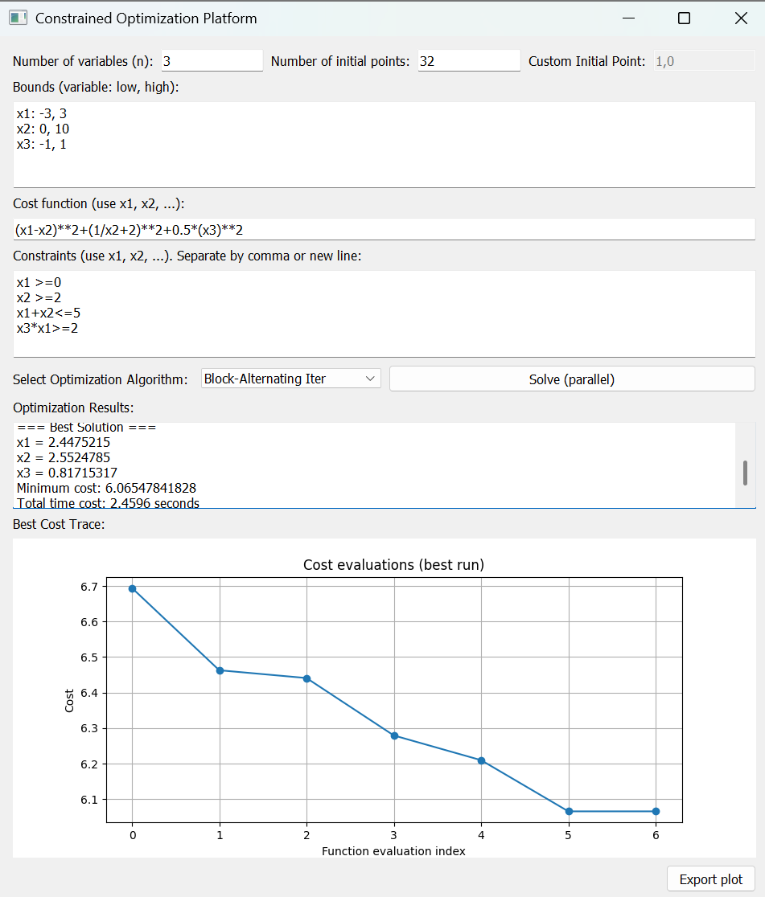

# Block-Alternating-Iterative-Optimization-GUI

## Project Description

This project is a constrained non-convex optimization platform designed for researchers seeking to solve constrained non-convex optimization problems using various solvers. It integrates our proposed block-alternating iterative method alongside other established solvers within a single interface. 

Our goal is to accelerate research progress by providing an accessible and efficient tool for the optimization community.

## Required Packages

To run this project, you need to install the following packages:

- `numpy`
- `matplotlib`
- `PyQt5`
- `scikit-learn`

You can install these packages using pip:

```bash
pip install numpy matplotlib PyQt5 scikit-learn
```

## Run the following command to start the GUI:

```bash
python3 qt_platform_CD.py
```


## Instructions for Using the GUI

Once you have installed the required packages and started the GUI, you will see the main interface of the Parallel Coordinate Descent platform. 



### Main Features:
- **Optimization Construction**: Write your own constrained non-convex optimization problem.
- **Adjust Parameters**: Modify the number of initial points.
- **Run Algorithm**: Select the algorithms shown in our paper, and observe the solution and iteration changes.
- **Export Plots**: 

### Tips:
- Use Python syntax to build your optimization problem. For example, **exp(x), x\**2, sqrt(x),log(x)**.
- Ensure your input constraints are valid.
- When selecting "Block-Alternating Iter" algorithm, please ensure your optimization problem is **convex** for each variable.


### Citation

If you use this platform in your research or projects, please cite our paper:

```
@inproceedings{li2023block,
    title={A Block-Alternating Iterative Approach for Structured Non-Convex Optimization},
    author={Anran Li and John P. Swensen and Mehdi Hosseinzadeh},
    booktitle={Proceedings of the IEEE Conference},
    year={2023},
    publisher={IEEE}
}
```


## Feedback and Contributions

We welcome your feedback! Please leave any issues, ideas, or comments you may have. Your input is invaluable in helping us improve the platform and better serve the optimization community.
